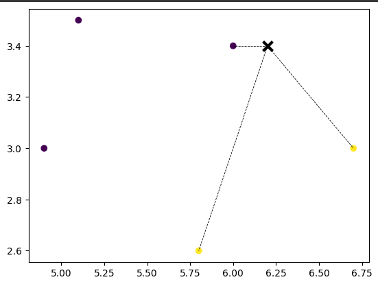

# K-Nearest Neighbors Algorithm

*In this section of the repository I'm going to talk about the KNN Algorithm which is a non parametric supervised learning classifier. As this is one of the most basic and classical machine learning algorithms, we're gonna see the theory and the practice without libraries, that is to say its background to know how it works.*

## Theory 
This algorithm classifies a point according to the classification of its k nearest neighbors or points, i.e. it assigns a class label according to the label that has more frequencies in its neighbors. To avoid ties we must give to K an odd value and preferably greater than the number of classes, because if we give a value of 3 to k and we have 3 classes there may still be ties. 

**But how do we know which are its nearest neighbors?**
To calculate its nearest neighbors we must take the distance of the point we want to classify with all the points on the map. There are different types of metrics to calculate the distance, some are: 
- Euclidean distance
- Manhattan Distance
- Minkowski distance

*So basically we must calculate the distance of the new point with all the points, know which are the K nearest points, know the classes of those K points, get the class that most repeats between those points and that is the class of the new point.*

To represent this better we have the following image, where we have 6 points, 5 points already have class and one does not, so to give a class to this one we will obtain its 3 nearest neighbors the new point is the X, its nearest points are the ones connected by dotted lines.

As we can see of its 3 neighbors 2 are yellow and 1 purple, so we will give it the class of 'yellow'.

**Advantages**
- It is easy to implement.
- The only hyperparameter it requires is the value of K.
- It adapts easily to new data.

**Disadvantages**
- As the data grows, the algorithm becomes slower and heavier, as it has to perform more operations when buying all the new points.
- You have to give the value to K and this can also impact the model’s behavior; since lower values of k can overfit the data, whereas higher values can underfit the data.
- It doesn’t perform well with high-dimensional data inputs.

**The section consits of 3 jupyter programs:**

## ManualKNN
This contains an implementation of the algorithm with a very small test and training list, where at the end a representation of the elements is made to have better visualization of the algorithm and check its performance. *This program doesn't need other files*

## KNN-Tumor
Here I use the algorithm made in the previous notebook, but now it is used for a real life case; it is used to classify tumors into benign or malignant, which is a problem that doctors have to deal with every day and the help of a program for the classification of these tumors is of utmost importance. *This notebook uses the file 'tumors.csv'.*

## KNN-Library
Once we know how the algorithm works we can use libraries to make the process simpler and more accurate, so in this program we will use the Scikit-Learn library and try giving different values to K to see how its behavior.*This notebook uses the file 'KNN.txt and KNN2.csv'.*