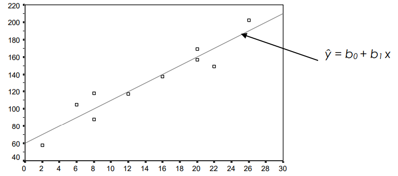
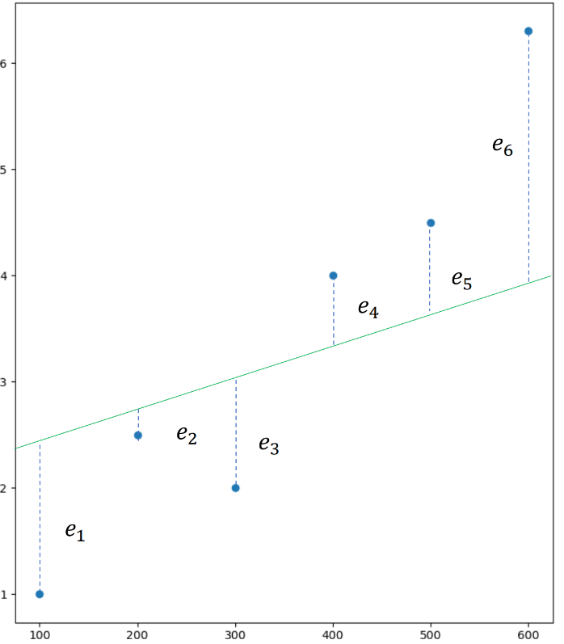

# Linear Regression

In practice we often need to solve problems involving **correlation between variables**; so in supervised learning we have a dataset *X* and from them we try to predict the values for the *Y* data set. The goal is to **create a model** that learn from the X data and **relate them** with the Y data.

The relationship between the *X* data and the *Y* values can be **determined by means of a function** $h(x)$ were the values to be predicted can be discrete or continous. 

Simple linear regression attempts to **find the line of best fit for a set of points.** The line of best fit is the equation that most accurately represents a set of points. For a given input, the equation’s output should be as **close to the expected output** as possible.More specifically, it identifies the relationship between an independent variable and a dependent variable. The line of best fit has the form of $y = mx + b$;  this equation, also known as the model, can also be evaluated in machine learning terms. In the equation, $w$ represents weight $\hat{y} = w_1x+ w_0$.

Prediction is not deterministic, since there may be many other unknown variables that affect the outcome, but we can make a good prediction.

## What is it about?

In this Jupyter Notebook we will make a linear regression without libraries to know how it work with the following methods:

1. **Ordinary Least Squares (OLS)**
2. **Batch Gradient Descent (BGD)**
3. **Stochastic Gradient Descent (SGD)**

All of these methods use **Sum Squared Errors** as loss function.

We will use a dataset about which contains information on the relationship between work experience (in months) and corresponding monthly salaries (in thousand dollars) of employees across various industries.

So in order to create the jupyter notebook, we need to know some previous concepts

## Estimated forecast

$$\Huge\hat{y} = b_0 + b_1x$$

$b_0 \leadsto$ intersection 

$b_1 \leadsto$ slope

$x \leadsto$ independent variable

$\hat{y}\leadsto$ estimated value of *y* for a specific value of *x*

## Estimated Error

Each regression line we choose to model the data will have an associated sum of the error with respect to the estimated regression line, where each error is bascially the residual.

$$\Huge\varepsilon=\sum_{i=1}^{n}|y_i-\hat{y_i}|$$

## Loss Function

Regression requires some method of **tracking the accuracy** of the model’s predictions. Given the inputs, are the outputs of the equation as close as possible to the expected output? A cost function, also known as a **loss function**, is used to **identify the accuracy of an equation**. If its predictions are poor, it is not very useful. 
We have 2 commonly used Loss Functions for Linear Regression:

-  **SSE = Sum of Squared Errors**

The **Ssum of Squared Errors** with respect to the estimated regression line. 

$$\Huge SSE(b_0, b_1)=\sum_{i=1}^{n}e_i^{2}=\sum_{i=1}^{n}(y_i-\hat{y_i})^{2}$$

-  **MSE = Mean Squared Errors**

The **Mean Squared Errors** with respect to the estimated regression line. 

$$\Huge MSE(b_0, b_1)=\frac{1}{n}\sum_{i=1}^{n}e_i^{2}=\frac{1}{n}\sum_{i=1}^{n}(y_i-\hat{y_i})^{2}$$

This functions find the **difference between the model’s prediction $\hat{y}$ and the expected output** $y$. It then **squares the difference to ensure the output is always positive.** It does this across a set of points with a size of n. The first one sums the squared difference of all these points and the second one does the same but after that it divides by n, obtainign as output the mean squared difference ($\varepsilon$)

### Optimization Problem

In machine learning, optimization is the **process of finding the ideal parameters**, or weights, to **maximize or minimize a cost or loss function**. The global maximum is the largest value on the domain of the function, whereas the global minimum is the smallest value.

To get the **minimun error** we have to **optimized the Loss Function** by finding a formula to obtain **the best** $b_0$ and $b_1$. For this we can perform partial derivatives for the Loss Function (Gradient). 

When we have **n independent variables** (multiple linear regression) and we are using SSE as the loss function we would have to do the following partial derivatives:

$$\huge\nabla SSE = \begin{bmatrix}
\frac{\partial SSE}{\partial b_0} \\  
\frac{\partial SSE}{\partial b_1} \\
... \\ 
\frac{\partial SSE}{\partial b_n}
\end{bmatrix}$$

If we want to do a simple linear regression with SSE, we will obtain:

$$\huge\nabla SSE = \begin{bmatrix}
\frac{\partial SSE}{\partial b_0} \\  
\frac{\partial SSE}{\partial b_1}
\end{bmatrix}=
\begin{bmatrix}
\frac{\partial\sum(\hat{y_i}-y_i)^{2}}{\partial b_0} \\  
\frac{\partial\sum(\hat{y_i}-y_i)^{2}}{\partial b_1}
\end{bmatrix}=
\begin{bmatrix}
\frac{\partial\sum(b_0+b_1x_i-y_i)^{2}}{\partial b_0} \\  
\frac{\partial\sum(b_0+b_1x_i-y_i)^{2}}{\partial b_1}
\end{bmatrix}
$$

Resulting in the following gradient:

$$\huge\nabla SSE = \begin{bmatrix}
2\sum b_0+b_1X_i-Y_i\\  
2\sum (b_0+b_1X_i-Y_i)X_i
\end{bmatrix}$$

If we have 2 independent variables, we would get:

$$\huge\nabla SSE = \begin{bmatrix}
2\sum b_0+b_1X_{1i}+b_2X_{2i}-Y_i\\  
2\sum (b_0+b_1X_{1i}+b_2X_{2i}-Y_i)X_{1i}\\
2\sum (b_0+b_1X_{1i}+b_2X_{2i}-Y_i)X_{2i}
\end{bmatrix}$$

When we use MSE as Loss Function, we would get the same, but the sum will be divided by m (number of examples or instances).

$$\huge\nabla MSE = \begin{bmatrix}
\frac{2}{m}\sum_{i=1}^{m} b_0+b_1X_i-Y_i\\  
\frac{2}{m}\sum_{i=1}^{m} (b_0+b_1X_i-Y_i)X_i
\end{bmatrix}$$

While there are countless other loss functions that are just as applicable to this situation, these are ones of the most popular loss functions in machine learning for regression due to its simplicity, especially when it comes to gradient descent

Once we have the Optimization for the loss fucntion we can use either Ordinary Least Squares or Gradient Descent.

## Ordinary Least Squares

In simple linear regression the ordinary least squares method consists of **finding the $b_0$ and $b_1$ values that minimize the sum of the squares** of the deviations between the observed values of the dependent variable $y_i$ and the estimated values of the same $\^{y_i}$. In other words, we **minimize the sum of the residuals or the error.**

**Solving the partial drivatives** of the optimization problem with an analytical method we can find the all the $b's$ values that minimize the sum by solving for each $b$. So when we have 1 independent variable we wolud obtain:

$\Huge b_0=\frac{\sum y_i - \sum b_1x_i}{n}=\bar{y}-b_1\bar{x}$

$\Huge b_1=\frac{n\sum x_iy_i - \sum x_i \sum y_i}{n\sum x_i^{2}-(\sum x_i)^{2}}$

### CONS

- With this method **there is no learning**.
- The independet variables should be **correlated** with the dependent variable, but **no with each other**.
- The **computational cost increases** considerably for multiple linear regression, (applied to a data set with many variables):
$\Huge \hat{y} = b_0 + b_1x_1 + ... + b_nx_n$ 

- Requires solve n+1 derivatives 
- Solve a system of n+1 equations 
- Make m summations

## Batch Gradient Descent

Applying the formula of Batch Descent and assuming that we are performing a simple linear resgression with the SSE loss function, we would obtain:     

$\Huge w_0' = w_0 - 2 \alpha \sum(\hat{y_i}-y_i) = w_0 - 2 \alpha \sum w_0+w_1X_i-Y_i$

$\Huge w_1' =  w_1 - 2 \alpha \sum(\hat{y_i}-y_i)X_i = w_1 - 2\alpha \sum (w_0+w_1X_i-Y_i)X_i$

As we can see, this is an **numerical method**, which means we have to **do iterations, until the conditions met**. As the process for $w_0$ and $w_1$ are very similar we can generalize it for n independent variables and make advantje of the matrix operation.

**SSE**

$\Huge w_{j}' =  w_{j} - 2 \alpha \sum(\hat{y_i}-y_i)X_{j,i} = w_{j} - 2\alpha \sum (w_0X_{0i}+w_1X_{1i}+...+w_nX_{ni}-Y_i)X_{j,i}$

**MSE**

$\Huge w_{j}' =  w_{j} - \frac {2 \alpha}{m} \sum(\hat{y_i}-y_i)X_{j,i} = w_{j} - \frac{2\alpha}{m} \sum (w_0X_{0i}+w_1X_{1i}+...+w_nX_{ni}-Y_i)X_{j,i}$

Where: 

- $n\leadsto$ number of weights
- $w\leadsto$ vector of the weights for the linear regression
- $j\leadsto$ number of $w$ in which we are
- $\alpha\leadsto$ learning rate
- $i\leadsto$ number instance of $X_j$ in which we are
- $m\leadsto$ number instances
- $y\leadsto$ vector with the values of the real $y's$
- $x\leadsto$ matrix with the values of $j-1$ independent variables 

## Stochastic Gradient Descent

The idea of Stochastic Gradient Descent is **not to use the entire dataset** to calculate the gradient but **only a single sample.** The objective is to speed up the process. The steps are:

1. Initialize a random guess for the weights (Start with some random guess for theta).
2. Randomly select a sample (x(i)), from the set of training data.
3. Compute its gradient(i.e gradient of x(i) alone).
4. Update weights using the update rule.
5. Repeat steps(2–4) for all training samples(from x(i) to x(n)) until convergence.

$\Huge w_{j} =  w_{j} - 2 \alpha (\hat{y_i}-y_i)X_{j,i} = w_{j} - {2 \alpha}(w_0X_{0i}+w_1X_{1,i}+...+w_nX_{n,i}-Y_i)X_{j,i}$

Where: 

- $w\leadsto$ vector of the weights for the linear regression
- $j\leadsto$ number of $w$ in which we are
- $\alpha\leadsto$ learning rate
- $i\leadsto$ random instance of $X$ 
- $y\leadsto$ vector with the values of the real $y's$
- $x\leadsto$ matrix with the values of $j-1$ independent variables 